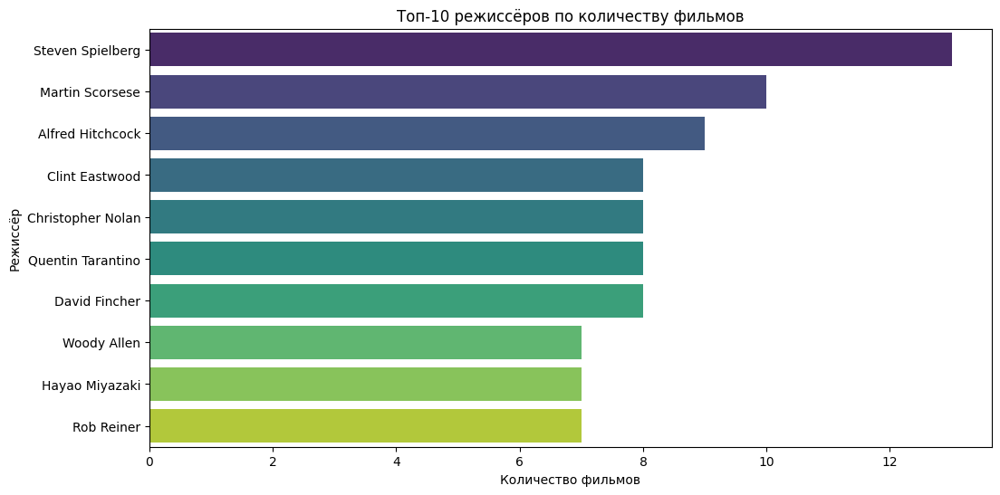
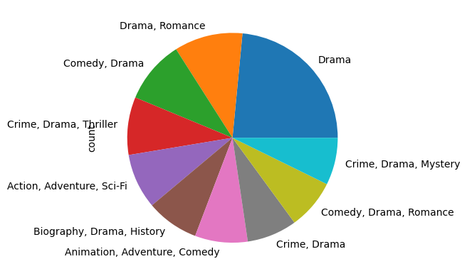
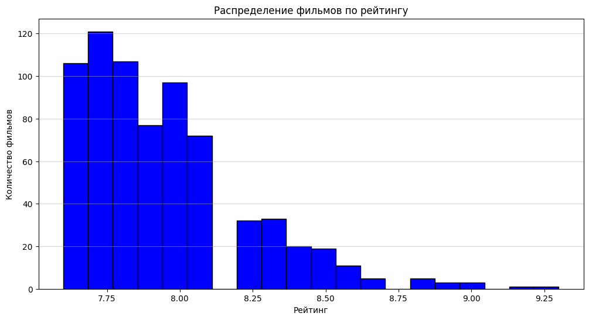
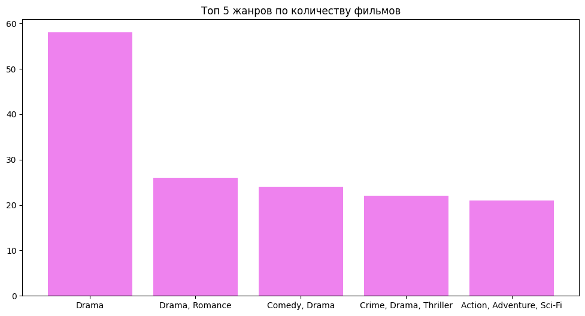

# Анализ датасета IMDb Top 1000
Этот проект анализирует датасет IMDB Movies Dataset(https://www.kaggle.com/datasets/harshitshankhdhar/imdb-dataset-of-top-1000-movies-and-tv-shows), содержащий информацию о 1000 лучших фильмов по версии IMDB.
### Основные этапы анализа:
Очистка данных: Удаление пропусков, обработка аномалий.
Исследование распределения рейтингов: Гистограммы, boxplot.
Анализ популярных жанров: Влияние жанра на рейтинг.
Визуализация: Графики для наглядного представления данных.
### Используемые библиотеки
Pandas, Numpy, Matplotlib, Seaborn.
### Результаты анализа
Топ 10 режжисёров по количеству фильмов

Диаграмма сравнение рейтнигов по жанрам

Распределение фильмов по рейтингу

Топ 5 жанров по количеству фильмов

### Как можно улучшить проект?
1.Добавить ML-модель для предсказания рейтинга.

2.Проанализировать динамику рейтингов по годам.

3.Сравнить с другими датасетами (Rotten Tomatoes, Кинопоиск).

4.Добавить интерактивные графики (Plotly).

Мой профиль в git: https://github.com/Denis-Egorov